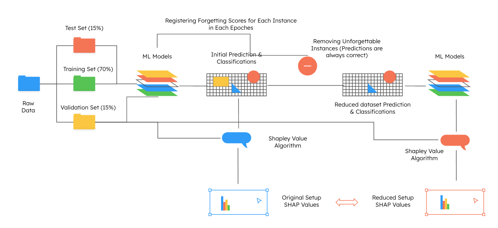

# Feature Importance Research for Forgetting Algorithm in Machine Learning Data Selection

## Insights into Feature Importance Using SHAP Values on Tabular Data

Authors: [Jiaxuan Bi], [Zhanyang Gong], [Dylan Newman], [Reza Serajian]

In this project, we aim to discuss the combination of two robust approaches to efficiently train a large-scale machine learning model. Specifically, we leverage forgetting events (Toneva et al., 2019) during the training process to prune data, thereby achieving important data selection while maintaining training performance and reducing the dataset size. Moreover, SHAP values (Lundberg and Lee, 2017) were used as an index of feature importance. Combined with the forgetting algorithm, this approach investigates the change in feature importance before and after dataset pruning.

#### Project Methodology


#### Folder Organization
```         
├── README.md          
├── images             <- Saved images for documentation
│
├── notebooks          <- Jupyter notebooks completed by the team
│
├── reports            <- Final Report and Presentation
│   └── figures        <- Generated graphics and figures to be used in reporting

```

--------

